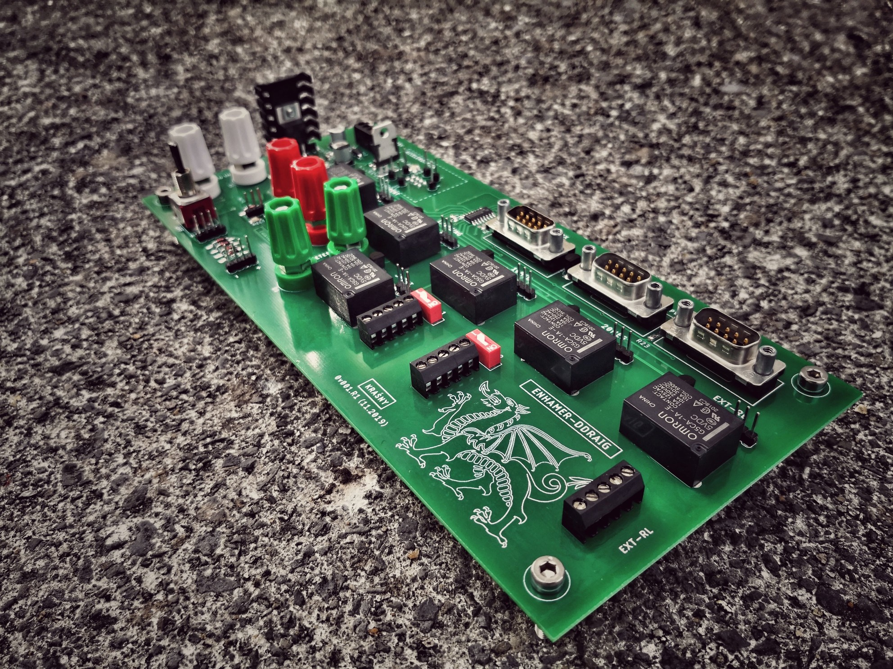
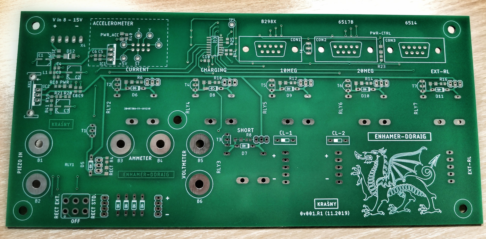
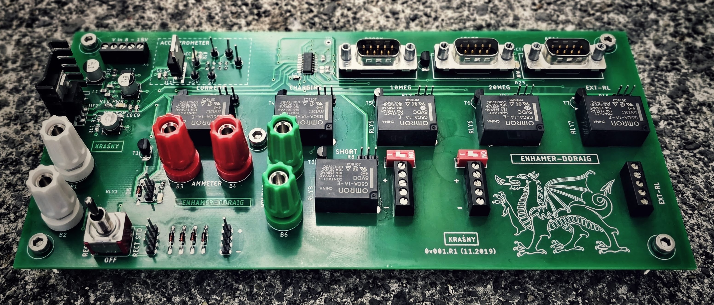

<!---
#**============================================================================
#**
#**                    Ddraig Control Board
#**                  THIS REPOSITORY IS PART OF THE ENHAMER
#**
#** TITLE:           Ddraig Ctrl PCB (Circuit, Hardware)
#**
#** AUTHOR:          Marcin J. Kraśny
#**
#**					 Advanced Biological Imaging Laboratory
#**                  School of Physics
#**                  College of Science and Engineering
#**                  National University of Ireland, Galway
#**
#** SOURCE URL       https://github.com/enhamer/enhamer
#** COPYRIGHT        © 2015-2020 M.J.Kraśny
#** LICENSE          CERN-OHL-P v2
#** CREDITS          NEMESIS - Novel Energy Materials, Engineering Science 
#**                  and Integrated Systems
#**                  Department of Mechanical Engineering
#**					 University of Bath, UK
#**
#**============================================================================
#**============================================================================
-->

# DDRAIG - Control - Board
Part of:
**Energy Harvesting Measurement Rig (ENHAMER)**

*A System for Characterisation of Piezoelectric Materials and Associated Electronics for Vibration Powered Energy Harvesting Devices*

>For detailed **Information, Manuals and Description** please go to [**ENHAMER**](https://github.com/enhamer/enhamer/).

# Design software used
[EAGLE CAD](https://www.autodesk.com/products/eagle/overview)

## Ddraig Board Layout Top Side View

## Ddraig Board PCB

## Ddraig Board Assembled

# License
Copyright © 2015-2020 Marcin J. Kraśny

This work is licensed under the [CERN-OHL-P v2](LICENSE/cern_ohl_p_v2.txt); 
[CERN Open Hardware Licence version 2](https://cern.ch/cern-ohl).

You may redistribute and modify this documentation and make products
using it under the terms of the CERN-OHL-P v2 (<https:/cern.ch/cern-ohl>).
This documentation is distributed WITHOUT ANY EXPRESS OR IMPLIED WARRANTY INCLUDING OF MERCHANTABILITY, SATISFACTORY QUALITY AND FITNESS FOR A PARTICULAR PURPOSE. 
Please see the CERN-OHL-P v2 for applicable conditions.

# SOURCE
[https://github.com/enhamer](https://github.com/enhamer/enhamer/)