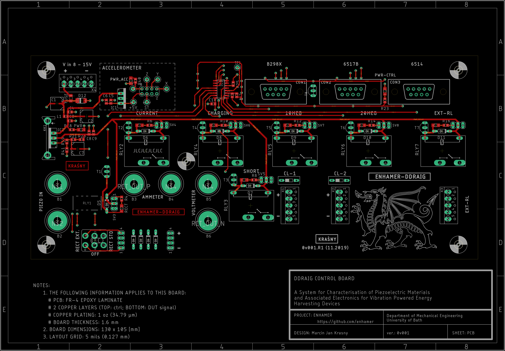

# DDRAIG - Control - Board
Part of:
**Energy Harvesting Measurement Rig (ENHAMER)**

*A System for Characterisation of Piezoelectric Materials and Associated Electronics for Vibration Powered Energy Harvesting Devices*

# CAD Software
EAGLE CAD (v9.5)

## Ddraig Board top

## Ddraig Board PCB

<!---
## Ddraig Board Assembled
-->

SOURCE: https://github.com/enhamer

Credits: NEMESIS- Novel Energy Materials, Engineering Science and Integrated Systems